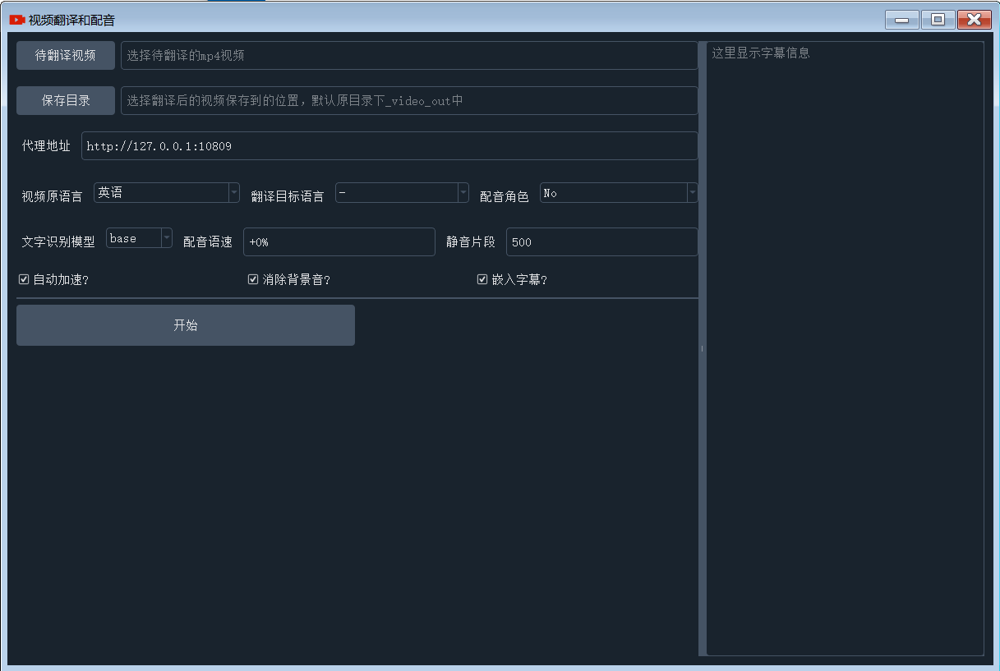

# [English](./README_ENG.md)

这是一个视频翻译工具，可将一种语言的视频翻译为另一种语言和配音的视频。
语音识别基于openai-whisper离线模型、文字翻译使用google翻译接口，文字合成语音使用 Microsoft Edge tts，背景音乐去除使用 Spleeter,无需购买任何商业接口，也无需付费

# 使用预编译版本方法
0. 只可用于 win10 win11 系统
1. 从 release中下载最新版，解压，双击 sp.exe
2. 创建一个文件夹，里面存放 mp4视频(mkv,avi,mpg),从软件界面“原始视频目录”中选择该文件夹；“输出视频目录”如果不选择，则默认生成在同目录下的“_video_out”
3. 如果你所在地区无法直接访问google，需要在软件界面“网络连接代理”中设置代理，比如若使用 v2ray ，则填写 `http://127.0.0.1:10809`,若clash，则填写 `http://127.0.0.1:7890`. 如果你修改了默认端口或使用的其他代理软件，则按需填写
4. 根据你的电脑性能，可修改“并发翻译数量”，即同时执行翻译的视频任务。
5. “配音选择”：选择目标语言后，可从配音选项中，选择配音角色；“去掉背景音”：选择 Yes 可尝试删掉背景音乐，以使结果更准确
6. “配音语速”：同样一句话在不同语言语音下，所需时间是不同的，因此配音后可能声画字幕不同步，可以调整此处语速，负数代表降速，正数代表加速播放。
7. 点击“开始执行”，会先检测能否连接google服务，若可以，则正式执行，右侧会显示当前进度，底部白色文本框内显示详细日志
8. 建议统一使用mp4格式，处理速度快，网络兼容性好
9. 采用软合成字幕：字幕作为单独文件嵌入视频，可再次提取出，如果播放器支持，可在播放器字幕管理中启用或禁用字幕；
10. 默认会在“原始视频目录”下生成同名的字幕文件“视频名.srt”
11. 对于无法识别的语音将直接复制原语音
12. 如果使用去除背景音功能，第一次需要下载模型，会比较耗时。你可以去下载这个压缩包  [**下载模型包**](https://github.com/jianchang512/pyvideotrans/releases/download/v0.3/2stems.zip)  ，然后将里面的文件解压到 \pretrained_models/2stems 目录下

# 源码部署修改

1. 电脑安装好 python 3.9+
2. `git clone https://github.com/jianchang512/pyvideotrans`
3. `cd pyvideotrans`
4. `pip install -r requirements.txt`
5. 解压 ffmpeg.zip 到根目录下
6. `python sp.py`
7. 如果使用去除背景音功能，第一次需要下载模型，会比较耗时。你可以去下载这个压缩包 [**下载模型包**](https://github.com/jianchang512/pyvideotrans/releases/download/v0.3/2stems.zip)  ，然后将里面的文件解压到 \pretrained_models/2stems 目录下

# 软件预览截图

# 视频前后对比
[原视频](https://www.wonyes.org/images/raw.mp4)

[翻译后的视频](https://www.wonyes.org/images/new.mp4)

# 可能的问题

> 在使用httpx和 googletrans 配置代理时可能报错，将 googletrans 包下 client.py 57 行左右改为 `proxies 类型 改为 httpcore.SyncHTTPProxy`

# 致谢

> 本程序依赖这些开源项目

1. pydub
2. ffmpeg
3. pysimpleGUI
4. googletrans
5. httpx
6. SpeechRecognition
7. edge-tts

