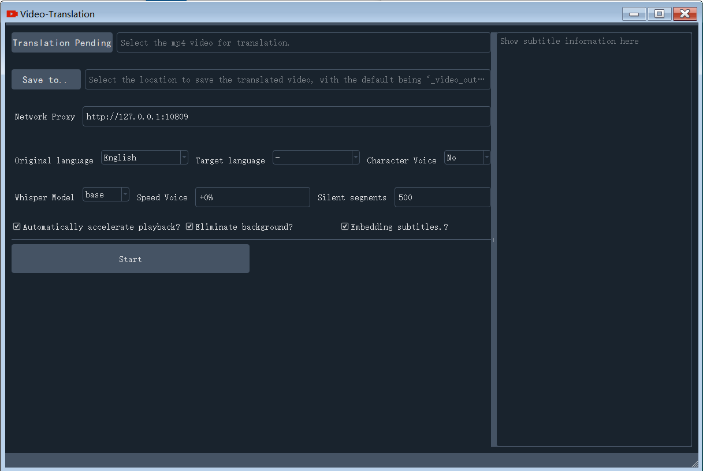

# [简体中文](./README_ENG.md)

This is a video translation tool that can translate videos in one language to another language and add voice-over to the video.
Speech recognition and text translation are done using the Google API, and text-to-speech synthesis is done using Microsoft Edge TTS without the need to purchase any commercial interfaces or pay any fees.

# Instructions for Using the Pre-compiled Version
0. Only available for Windows 10 and Windows 11 systems.
1. Download the latest version from the release, unzip it, and double-click on sp.exe.
2. Create a folder to store the mp4 video (mkv, avi, mpg) and select this folder as the "Original Video Directory" in the software interface. If you do not select the "Output Video Directory," it will be generated by default in the same directory as "_video_out."
3. If you cannot directly access Google from your region, you need to set up a proxy in the "Network Connection Proxy" section of the software interface. For example, if you are using V2Ray, enter `http://127.0.0.1:10809`, or if you are using Clash, enter `http://127.0.0.1:7890`. If you have modified the default port or are using other proxy software, fill it in as needed.
4. Depending on the performance of your computer, you can modify the "Concurrent Translation Quantity" to specify the number of video tasks to be translated simultaneously.
5. "Voice-over Selection": After selecting the target language, you can choose a voice-over character from the voice-over options.
6. "Voice-over Speed": The time required for the same sentence in different language voices varies, so the subtitles may be out of sync after voice-over. You can adjust the speed here, where negative values represent a slowdown and positive values represent a faster playback.
7. Click "Start Execution." It will first check whether it can connect to Google services. If it can, it will proceed with the execution. The current progress will be displayed on the right side, and detailed logs will be displayed in the white text box at the bottom.
8. It is recommended to use the MP4 format for better processing speed and network compatibility.
9. Utilize soft-encoded subtitles: Embed subtitles as separate files in the video, which can be extracted again. If supported by the player, you can enable or disable subtitles in the player's subtitle management section.
10. By default, a subtitle file with the same name as the video will be generated in the "Original Video Directory" as "video_name.srt."
11. Unrecognized voices will be copied directly.

# Deployment and Modification of Source Code

1. Install Python 3.9+ on your computer.
2. `git clone https://github.com/jianchang512/pyvideotrans`
3. `cd pyvideotrans`
4. `pip install -r requirements.txt`
5. Unzip ffmpeg.zip into the root directory.
6. `python sp.py`
7. To package locally, use `pyinstaller -w sp.py`.

# Software Preview Screenshots

# Original Video and Translated Video

[Original Video](https://www.wonyes.org/images/raw.mp4)

[Translated Video](https://www.wonyes.org/images/new.mp4)

# Possible Issues

> When using httpx and setting up proxies with googletrans, you may encounter an error. In the googletrans package, at around line 57 in client.py, change the `proxies` type to `httpcore.SyncHTTPProxy`.

# Acknowledgements

> This program relies on the following open-source projects:

1. pydub
2. ffmpeg
3. pysimpleGUI
4. googletrans
5. httpx
6. SpeechRecognition
7. edge-tts